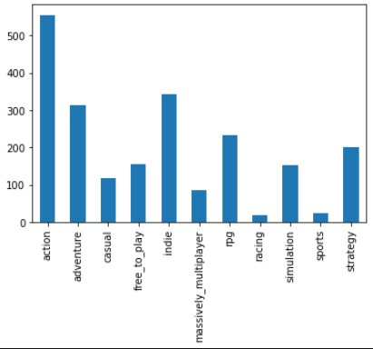
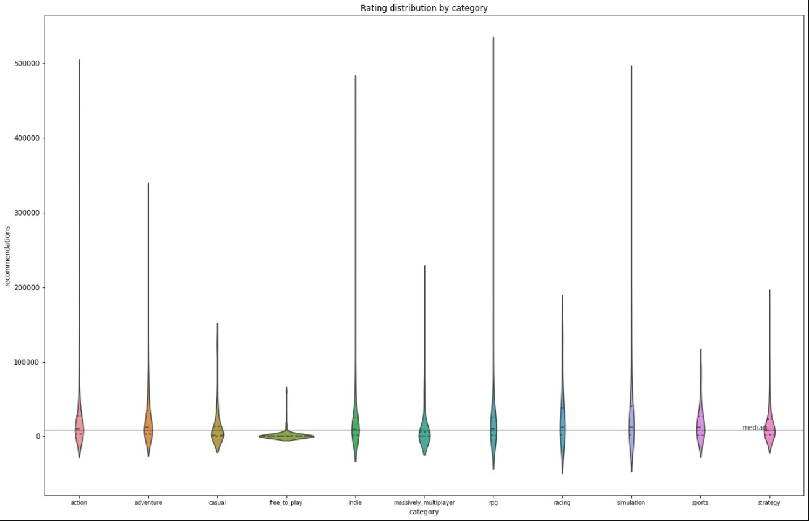

# **Recommendations per Category on Steam**
## Background
For this project I wanted to learn how to call to an API and then take that information and analyze it. I decided to look at Steam's API (Steam is a program where game developers and game artists can post their game for sale or for free, as some free-to-play game developers have done, and each person has their own account) as I am interested in video games and I want to see if there is a game category that gets more recommendations then any other category.
## Data Collection
For this project I wanted to try to call to an API (application programming interface). I had some problems with getting it working as it was something new that I had never tried before. I made some functions that let me call to Steam's API and then download that data as a CSV file. A function that I made to call to the API was set up to space out my call requests so that way I wouldn't overwhelm the API and get blocked from calling to it anymore. It was designed to grab data in batches reading through my index file that I made from SteamSpy's API as I was planning on using both SteamSpy and Steam for this project. I ended up only using Steam's data for now but I would like to go back and look at some other questions that I could ask and for that I would like SteamSpy's information as well. One limiting factor that I found as well was that SteamSpy's API was set up with pages and you couldn't call to get everything that they had so I only have a sample size of 1000 apps to work with.

Check out my Jupyter Notebook on how I got my Data from the Steam API [here!](https://github.com/LuckAJ/SteamAPI_Categories_and_Recommendations/blob/main/Steam_Project_Collection.ipynb)
## Question: Is there a game category that gets more recommendations?
### Exploration
So to start off I want to see how many games are categorized into each category that I have. That way I have a baseline for the shape of the violin plot that I want to do for each category.

So in my sample I can see that there is more Action games then there are any other. That tells me to expect my violin to be wider then say the Racing games.
### Answering the Question

Since I only have 1000 apps worth of data my results are not necessarily representative of all the apps on Steam as a whole. To get more representative results I would gather a greater sample size.

First off I can see that Free-To-Play games are not recommended to others to play very much. The top recommended game still does not reach as high as all other categories. So if you wanted to make a game that others would recommend to others to try you should not make it free-to-play. Role playing games (RPG) have a game that is the highest recommended and most have higher recommendations than the median recommendations. So there are not as many in my sample so it is not as saturated in the market as some other categories like Free-to-play for example. 

You can see my code for what I cleaned and analyzed [here!](https://github.com/LuckAJ/SteamAPI_Categories_and_Recommendations/blob/main/Steam_Project.ipynb)

## Conclusion
So for any game developers out there I would recommend creating a simulation game as the market is not as saturated and they are almost as highly recommended as RPGs. So it would be easier to stand out and to get word of mouth from your players that would recommend it to others.
